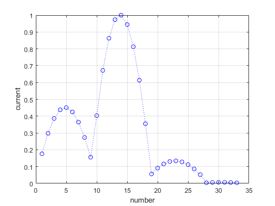
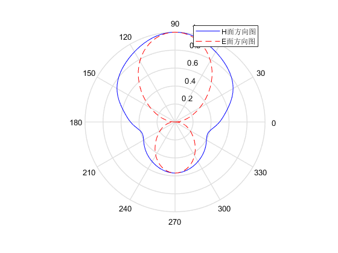

# yagi_antenna_mom_matlab

本程序延用《简明天线教程》的程序，稍作修改

原程序中的distance函数在matlab2021版本中已经不适用，我便自己写了mydistance函数代替该函数。

该程序的展开函数为分域脉冲基函数，权函数选择了delta函数。

用的公式还是《简明天线教程中的》(6-16)式，只不过是遍历所有分段之间的组合，计算第m个分段和第n个分段之间的阻抗，
其中m可以等于n。

同时我也在代码中做了一些注释，得到的电流分布和方向图如下所示

